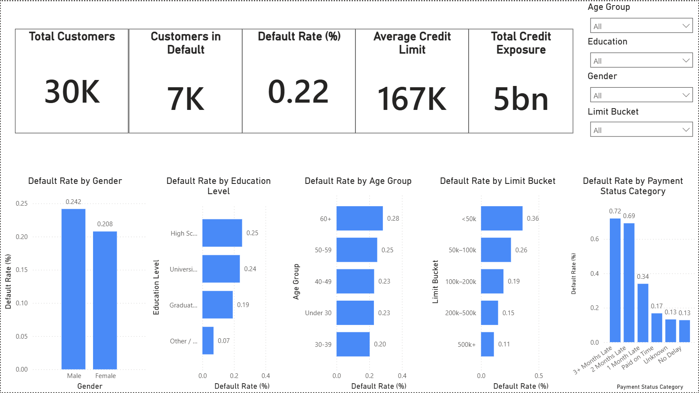

# Credit Risk Reporting Dashboard (SQL + Power BI)

This project demonstrates an **end-to-end data analysis workflow** for a **Credit Risk Reporting Dashboard**, including data cleaning, KPI creation, segmentation analysis, and reporting automation.

---

## Project Overview

The goal of this project is to analyze credit card client behavior and identify **which customer segments have the highest default risk**.  
Using SQL and Power BI, I built:  
- A **credit risk KPI layer**  
- Customer segmentation views (gender, education, age group, credit limit bucket)  
- A professional **interactive dashboard** with drilldowns and slicers  

---

## Tech Stack
- **SQL (PostgreSQL compatible)**  
- **Power BI**  
- **DAX**  
- **Power Query**  
- **Data modeling practices**

---

## Dataset

Dataset: *Default of Credit Card Clients* (UCI / Kaggle).  
Contains 30000 customers with demographic, financial, and payment behavior variables.  
Target variable: **default_payment_next_month** (1 = default, 0 = no default).

*Dataset file not included due to license restrictions.*

---

## Data Preparation (SQL)

Key steps performed in SQL (full script in `credit_risk_sql_script.sql`):

### Data Cleaning & Encoding  
- Converted coded variables (gender, education, marriage) into readable labels  
- Created **age buckets** and **credit limit buckets**  
- Validated ranges and checked for NULL values  

### KPI View  
Aggregated customer-level metrics:  
- Total Customers  
- Customers in Default  
- Default Rate (%)  
- Average Credit Limit  
- Total Credit Exposure  

---

## Power BI Dashboard

### KPI Cards
- **Total Customers**  
- **Customers in Default**  
- **Default Rate (%)**  
- **Average Credit Limit**  
- **Total Credit Exposure**  

### Segmentation Analysis
Visuals showing default rate by:  
- Gender  
- Education Level  
- Age Group  
- Credit Limit Bucket  
- Payment Status Category  

### Interactivity
Slicers for:  
- Age Group  
- Education  
- Gender  
- Credit Limit Bucket  

---

## Dashboard Preview

```

```

---

## Key Insights

- The case shows **7,000 customers in default**, a relatively high level for a retail credit population. Despite an average credit limit of **167K**, the default rate indicates significant behavioural risk among certain demographic and financial segments.
- Gender-based analysis shows males carry higher risk. Although gender differences should not influence credit decisions directly (due to regulatory and ethical constraints), this pattern may reflect **behavioural factors, financial stability differences, or payment discipline trends**.
- Education level correlates strongly with credit performance. Customers with **lower educational attainment** show **higher default risk**, a trend consistent with industry research linking education to income stability and credit behaviour.
- Age-based risk profile shows older customers default more frequently. The **60+ segment is the highest-risk group**, potentially due to fixed-income dependence, lower liquidity, or changing financial priorities.
- Credit limit is one of the strongest predictors of default risk. **Low credit limits correlate with much higher risk**, likely reflecting weaker financial profiles or thin-file customers. Customers with **high credit limits (200k+) show significantly lower risk**, consistent with higher income stability and stronger repayment capability.
- Payment history is the strongest behavioural indicator of future default. Customers with **any recent delinquency** (>1 month late) have dramatically elevated risk. The jump from **1-month delay (34%)** to **2-month delay (69%)** indicates a cliff effect, suggesting that once customers fall behind, recovery becomes unlikely. This is a critical signal for early intervention strategies, such as payment reminders, restructuring offers, or risk-based customer outreach.

High-risk customers are concentrated in two core segments:
- **Low credit limits (<100k)**
- **Recent payment delays (1+ months)**

Based on typical portfolio behaviour, the highest-risk customer archetype is likely: 
**Male + High School education + Low credit limit (<50k) + Recent payment delay**

---

## Contact

- **LinkedIn:** linkedin.com/in/savelii-seliaev
- **Email:** seliaevsava@gmail.com
